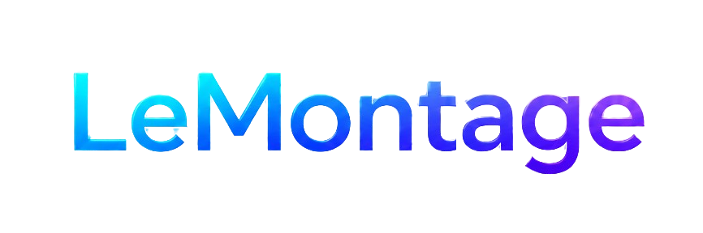
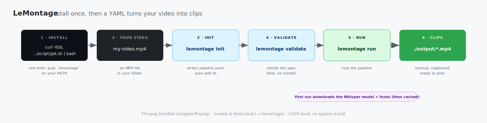

<p align="center">
  
</p>

> The TailwindCSS of automated video creation for social media.

[](https://github.com/FleoThing/LeMontage/actions/workflows/test.yml)
[](https://github.com/FleoThing/LeMontage/actions/workflows/quality.yml)


LeMontage is a local-first YAML pipeline engine for turning long videos into short,
captioned, ready-to-post clips. You describe the workflow once, then LeMontage
runs the media steps: transcription, clip detection, cutting, captions and export.

## Tech Stack

- **Language**: Python 3.10+
- **Pipeline format**: YAML
- **CLI packaging**: setuptools, editable installs, `pipx`
- **Media processing**: FFmpeg via `imageio-ffmpeg`
- **Speech-to-text**: Whisper through `faster-whisper`
- **Validation**: custom YAML validator backed by `pyyaml`
- **Testing**: pytest
- **Linting and formatting**: Ruff, pre-commit
- **Containers**: Docker, Docker Compose
- **CI and security**: GitHub Actions, Hadolint, Trivy, CodeQL



## 1. What LeMontage Does

LeMontage turns this kind of intent:

```text
Make me a viral short from this podcast, energetic, 60 seconds max.
```

into a repeatable pipeline:

```yaml
lemontage: "1.0"
name: highlights

input:
  type: video
  source: ./episode.mp4

steps:
  - id: transcript
    stt:
      model: base
      lang: auto

  - id: clips
    detect_clips:
      method: loudness
      max_clips: 5
      emit: clips

  - cut:
      from: clips

  - captions:
      from: clips
      words: "{{ steps.transcript.words }}"
      style: tiktok

  - export:
      from: clips
      format: vertical
      title: "My Channel"

output:
  dir: ./output
```

Inside a run, the YAML becomes a DAG: one source video fans out into captioned,
titled vertical clips that can be processed in parallel and resumed through cache.


### Core Ideas

- **Declarative**: describe the media pipeline in YAML instead of writing glue code.
- **Local-first**: runs on your machine; Whisper STT runs locally through `faster-whisper`.
- **Composable**: blocks, channels, matrix runs, cache, retries and named outputs.
- **Agent-friendly**: the format is constrained and validatable, so coding agents can generate it.
- **Shareable**: pipelines are plain files that can be reviewed, versioned and reused.

### Current Scope

LeMontage v0.1.x targets MP4 input and local execution. The implemented engine covers
STT, clip detection, cutting, captions, export, concat, cache, matrix, channels and
`on_failure` handling. Automatic publishing to social platforms is out of scope for
the current engine.

Full examples:

- [`examples/podcast-to-clips.yaml`](examples/podcast-to-clips.yaml)
- [`examples/ufc-highlights.yaml`](examples/ufc-highlights.yaml)

Reference docs:

- [YAML Specification](docs/SPEC.md)
- [`man` page](docs/lemontage.1)
- [Contributing guide](CONTRIBUTING.md)

## 2. Install And Deploy

### Which Method Should I Use?

| Method | Best for | Security note |
|---|---|---|
| `pipx` from GitHub | Daily CLI usage on your machine | **Recommended for users.** Isolated Python app install; review the GitHub ref before running. |
| `curl | bash` | Fast install on a disposable or personal machine | Convenient, but pipes remote code into a shell. Read the script first for sensitive machines. |
| Docker Compose | Local deployment and repeatable runs | **Recommended for isolation.** Runs in a container and mounts only the project folder. |
| Docker CLI | CI, servers, reproducible builds | Good isolation; pin tags or commit SHAs for production. |
| Source install | Development and contribution | Full repo checkout; safest when you want to inspect or modify code before running. |

### Option A: `pipx` Install

Use this if you want `lemontage` available like a normal CLI without activating a
virtualenv.

```bash
python3 -m pip install --user pipx
python3 -m pipx ensurepath
pipx install "lemontage[engine] @ git+https://github.com/FleoThing/LeMontage@main"
lemontage --version
```

Security note: this installs from the `main` branch. For stricter environments,
replace `@main` with a reviewed tag or commit SHA.

### Option B: One-Line Installer

Linux/macOS installer. It installs `pipx` if missing, then installs LeMontage with
the media engine extra.

```bash
curl -fsSL https://raw.githubusercontent.com/FleoThing/LeMontage/main/infrastructure/script/get.sh | bash
```

Safer variant:

```bash
curl -fsSL https://raw.githubusercontent.com/FleoThing/LeMontage/main/infrastructure/script/get.sh -o get.sh
less get.sh
bash get.sh
```

Security note: `curl | bash` is the least auditable install path. Use it for speed,
not for locked-down production machines.

### Option C: Docker Compose

Use this for local deployment with no Python setup on the host.

```bash
git clone https://github.com/FleoThing/LeMontage
cd LeMontage
docker compose -f infrastructure/local/compose.yaml build
docker compose -f infrastructure/local/compose.yaml run --rm lemontage --help
docker compose -f infrastructure/local/compose.yaml run --rm lemontage validate examples/podcast-to-clips.yaml
```

Run your own pipeline from the repo folder:

```bash
docker compose -f infrastructure/local/compose.yaml run --rm lemontage run pipeline.yaml
```

Security note: Compose mounts the repo into `/work` and keeps model caches in named
Docker volumes. This is the best local isolation path while the image is built from
source.

### Option D: Docker CLI

```bash
git clone https://github.com/FleoThing/LeMontage
cd LeMontage
docker build -t lemontage .

docker run --rm -v "$PWD":/work lemontage validate examples/podcast-to-clips.yaml
docker run --rm -v "$PWD":/work lemontage run pipeline.yaml
```

Keep Whisper and font caches between runs:

```bash
docker run --rm -v "$PWD":/work \
  -v lemontage-cache:/root/.lemontage \
  -v hf-cache:/root/.cache/huggingface \
  lemontage run pipeline.yaml
```

Security note: pin a reviewed tag or commit SHA when building images for CI or
servers.

### Option E: From Source

Use this when you want to inspect the code, contribute, or run tests.

```bash
git clone https://github.com/FleoThing/LeMontage
cd LeMontage
python -m venv .venv
. .venv/bin/activate
python -m pip install -U pip
pip install -e ".[engine,dev]"
```

Then:

```bash
lemontage init pipeline.yaml
lemontage validate pipeline.yaml
lemontage run pipeline.yaml
```

Security note: this is the most auditable path because you can inspect the repo
before running anything. It also gives you the full development toolchain.

### Option F: Install Scripts From Source

These scripts create a local `.venv`, install the engine extra and install the man
page on Linux/macOS.

```bash
git clone https://github.com/FleoThing/LeMontage
cd LeMontage

# Linux/macOS
./infrastructure/script/install.sh

# Windows PowerShell
./infrastructure/script/install.ps1
```

Security note: use these after cloning the repo so you can inspect the script first.

## Quick Commands

```bash
lemontage init pipeline.yaml
lemontage validate pipeline.yaml
lemontage run pipeline.yaml
lemontage run pipeline.yaml --var lang=fr --clean
```

## License

MIT - free to use, modify and distribute.
