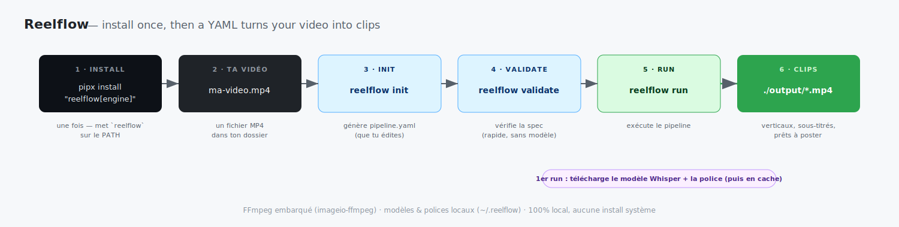
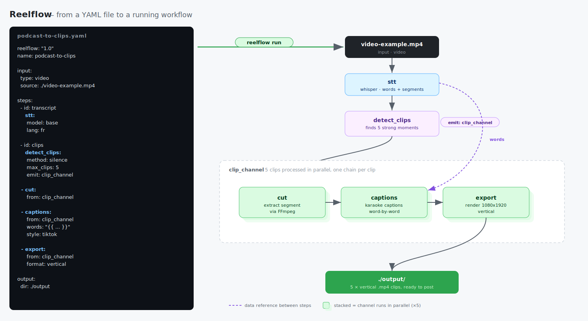

# LeMontage

> The TailwindCSS of automated video creation for social media.

[](https://github.com/FleoThing/LeMontage/actions/workflows/ci.yml)


LeMontage is a declarative YAML pipeline framework for automating the creation of viral videos - Shorts, Reels, TikToks and more - without writing the same boilerplate code for every new trend.



## Vision

Just as TailwindCSS became a de-facto standard for web styling (largely replacing hand-written CSS), LeMontage aims to be the standard language for automated video creation - for people and autonomous agents alike.

There is **nothing AI-specific** inside LeMontage. It's a plain, declarative YAML format with a clear, self-contained spec ([SPEC.md](docs/SPEC.md), `man lemontage`) - simple enough that anyone, or any coding agent (Claude Code, OpenClaw, …), can read it and write a valid pipeline **with no SDK or special integration**. The intelligence stays in the human or the agent; LeMontage just runs the result, locally and reliably.

So the end-to-end story becomes: an agent turns a one-line intent into a valid pipeline, and LeMontage executes it.

```
"Make me a viral short about the DeepSeek trend, energetic, 60s"
        ↓
   AI generates YAML
        ↓
  LeMontage executes
        ↓
     🎬 Video
```

## What it does

LeMontage lets you define a video production workflow as a YAML file - a series of composable steps (transcription, clip detection, captions, export) that execute as a DAG (Directed Acyclic Graph), with automatic parallelism and resumability.

> 🎬 **Coming soon:** animated transitions between clips (fades, cuts, filters) for ready-to-post montages.

> **Scope v1:** MP4 input only. Output saved to `./output/` by default (overridable in YAML). Automatic publishing to social platforms is out of scope for v1.

```yaml
lemontage: "1.0"
name: highlights

input:
  type: video
  source: ./episode.mp4

steps:
  - id: transcript
    stt:
      model: base
      lang: auto

  - id: clips
    detect_clips:
      method: loudness        # or: silence | scene_change
      max_clips: 5
      emit: clips

  - cut:
      from: clips

  - captions:
      from: clips
      words: "{{ steps.transcript.words }}"   # word-by-word karaoke
      style: tiktok

  - export:
      from: clips
      format: vertical
      title: "My Channel"

output:
  dir: ./output
```

## Built-in blocks

| Block | What it does |
|---|---|
| `stt` | Speech-to-text — timed transcript (word + segment timings), local via faster-whisper |
| `detect_clips` | Find the strong moments and emit them as a channel of clips |
| `cut` | Extract each detected clip as its own video |
| `captions` | Burn word-by-word (karaoke) subtitles onto the video |
| `export` | Final render — vertical / horizontal / square, optional title |
| `concat` | Stitch clips into a single video |
| `reverse` | Play a clip backwards (video + audio) |

See the [YAML Specification](docs/SPEC.md) for each block's parameters.

## Example workflow

Inside a run, a single YAML file becomes a DAG: one source video fans out into N
captioned, titled vertical clips - processed in parallel - and optionally merged
into one reel.



> Full pipelines: [`examples/podcast-to-clips.yaml`](examples/podcast-to-clips.yaml)
> · [`examples/ufc-highlights.yaml`](examples/ufc-highlights.yaml)

## Why it matters

Content creation pipelines are naturally DAG-shaped:

```
raw video
    │
    ├──► STT (transcription)
    │         │
    │         ├──► hook detection ──► clip cutting
    │         └──► subtitle generation
    │
    └──► audio extraction ──► rhythm analysis
```

Today, every creator rewrites this plumbing from scratch. LeMontage makes it **define once, reuse everywhere**, and lets the community share recipes for every trend and format.

## Community Hub

> 🔜 **Planned (not in v1):** a community hub will be created where anyone can
> deposit their pipelines and exchange ready-made video-creation templates.

Anyone can publish their YAML pipelines. A creator specializing in Reddit Stories shares their pipeline. A finance creator shares theirs. A news channel shares theirs.

The more pipelines in the hub, the better AI models become at generating them - a self-reinforcing flywheel.

## Stack

### Phase 1 - 100% local, no external dependencies

| Layer | Technology |
|---|---|
| Orchestration engine | Python |
| Media processing | FFmpeg (system, or bundled via `imageio-ffmpeg`) |
| STT | Whisper via `faster-whisper` (local) |
| TTS | _planned for v2_ - see below |
| LLM | _planned_ - local via Ollama (script/scoring blocks, not in v1) |

> *STT uses [Whisper](https://github.com/openai/whisper), OpenAI's open-source
> speech-to-text model, run locally via `faster-whisper` (no API, offline after
> the first download). Pick the model size (`tiny` → `large`) to trade speed for
> accuracy and download size - see [SPEC §6.1](docs/SPEC.md).*

> **Text-to-speech is deferred to v2.** It will be added once the engine can mux
> a voiceover onto video (faceless / narrated content). Planned stack, all local:
> `kokoro-onnx` (synthesis) + `onnxruntime` (inference) + `soundfile` (write audio).
> Removed from v1 to keep the install light (no `onnxruntime`).

The entire pipeline runs on your machine. No API key, no internet connection, no usage cost.

### Phase 2 - Optional cloud providers

Once the core is stable, swappable cloud providers will be added as optional plugins:

| Layer | Provider |
|---|---|
| STT | Deepgram |
| TTS | ElevenLabs |
| LLM | Claude, GPT-4 |

Switching provider = one line change in your YAML. The pipeline logic stays the same.

## Architecture

```
src/lemontage/
├── validator.py        # validate a pipeline against the v1 spec
├── spec.py             # single source of truth for the spec constants
├── cli.py              # run / validate / init
└── engine/
    ├── template.py     # {{ }} reference resolution
    ├── dag.py          # dependency graph builder
    ├── executor.py     # states, cache, on_failure, channels, matrix
    ├── ffmpeg.py       # FFmpeg wrapper (system or bundled binary)
    ├── timecode.py     # duration / timecode parsing
    ├── blocks/         # built-in steps
    │   ├── stt.py  detect_clips.py  cut.py
    │   └── captions.py  export.py  concat.py  reverse.py
    └── providers/      # swappable adapters
        ├── base.py     # STTProvider interface
        └── whisper.py  # faster-whisper
```

## Key design principles

- **Declarative** - describe what you want, not how to do it
- **Local-first** - runs fully offline with open-source models; FFmpeg bundled
- **Composable** - channels, matrix, checkpoints, named outputs and states (proven pipeline paradigms)
- **Shareable** - pipelines are plain YAML files, not code

*By design (for the future):* the format is intentionally constrained and validatable, so AI agents can reliably generate it, and providers (STT/TTS/LLM) can be swapped in later - see [Vision](#vision).

## Installation

### 1. One-liner (recommended)

Linux/macOS - installs pipx if needed, then LeMontage as a global CLI you can run
from anywhere (like `nextflow`):

```bash
curl -fsSL https://raw.githubusercontent.com/FleoThing/LeMontage/main/get.sh | bash
```

Or do the pipx step yourself (any OS, needs Python 3.10+ and
[pipx](https://pipx.pypa.io)):

```bash
pipx install "lemontage[engine] @ git+https://github.com/FleoThing/LeMontage@main"
lemontage --version
```

Prerequisites per OS:

```bash
# Debian/Ubuntu/Lubuntu/Mint…   sudo apt install pipx git fontconfig && pipx ensurepath
# macOS                          brew install pipx && pipx ensurepath
# Windows (PowerShell)           py -m pip install --user pipx; py -m pipx ensurepath
```

> Not on PyPI yet, so we install straight from GitHub (`main` branch). Once
> published this becomes `pipx install "lemontage[engine]"`. Drop `[engine]` for a
> light, validate-only install.

### 2. Docker (zero local setup)

No Python or system deps to manage. Build the image from source, then run
pipelines against your current folder (mounted as the working dir):

```bash
git clone https://github.com/FleoThing/LeMontage && cd LeMontage
docker build -t lemontage .

docker run --rm -v "$PWD":/work lemontage run pipeline.yaml
docker run --rm -v "$PWD":/work lemontage validate pipeline.yaml
docker run --rm -v "$PWD":/work lemontage init

# Keep the Whisper model + fonts between runs (avoid re-downloading):
docker run --rm -v "$PWD":/work \
  -v lemontage-cache:/root/.lemontage -v hf-cache:/root/.cache/huggingface \
  lemontage run pipeline.yaml
```

> A prebuilt `ghcr.io/FleoThing/LeMontage` image will be published by the release
> CI later, so you can skip the build step.

### 3. From source (developer setup)

```bash
git clone https://github.com/FleoThing/LeMontage && cd LeMontage
python -m venv .venv && . .venv/bin/activate
pip install -e ".[engine]"        # add the media/model dependencies

lemontage init pipeline.yaml        # write a starter pipeline
lemontage validate pipeline.yaml    # check it against the spec
lemontage run pipeline.yaml         # produce the clips into ./output/
```

**What is `".[engine]"`?** `.` is the project in the current folder (its
`pyproject.toml`); `[engine]` is the optional **extra** that pulls the libraries
needed to *run* pipelines - `imageio-ffmpeg` (bundled FFmpeg) and `faster-whisper`
(speech-to-text). So:

| Command | Installs | Lets you |
|---|---|---|
| `pip install .` | core only (`pyyaml`) | `init`, `validate` |
| `pip install ".[engine]"` | core **+ engine** | `init`, `validate`, **`run`** |
| `pip install -e ".[engine]"` | same, **editable** (source-linked) | develop on LeMontage |

> The Whisper model and title fonts download on first use - see
> [SPEC §13](docs/SPEC.md).
>
> ℹ️ This (clone + venv) is the **developer** setup - `lemontage` only works inside
> the activated venv. To use it **anywhere like a normal CLI** (no venv to
> activate), install with `pipx` instead:
> ```bash
> pipx install "lemontage[engine] @ git+https://github.com/FleoThing/LeMontage@main"
> ```

### 4. Install scripts (from source)

Install the system prerequisites, create a venv and install LeMontage in one step.

```bash
git clone https://github.com/FleoThing/LeMontage && cd LeMontage

# Linux (apt: Debian/Ubuntu/Lubuntu/Mint/Pop!_OS…) or macOS (Homebrew)
./install.sh

# Windows (PowerShell)
./install.ps1
```

`install.sh` also installs the man page (`man lemontage`). For a no-clone install,
use the [one-liner](#1-one-liner-recommended) above; a hosted
`install.lemontage.dev` shortcut will come later.

### 5. Coming soon - PyPI (`pip install lemontage`)

```bash
# pip
pip install lemontage

# uv
uv tool install lemontage
```

Native installation with optional extras for STT, TTS, and LLM blocks will be available once the core is stable.

## Documentation

- [YAML Specification](docs/SPEC.md) - the authoritative reference for the pipeline file format and all built-in blocks.
- [`man` page](docs/lemontage.1) - CLI reference. View with `man -l docs/lemontage.1`, or install with `cp docs/lemontage.1 ~/.local/share/man/man1/ && mandb` then `man lemontage`.

## License

MIT - free to use, modify, and distribute.

## Status

> v1 engine implemented: the seven built-in blocks run end to end (STT, clip
> detection, cutting, captions, export, reverse) with channels, matrix, caching and
> `on_failure` handling. Distribution (Docker, install script, pip) and the
> community hub are next. Contributors welcome.
